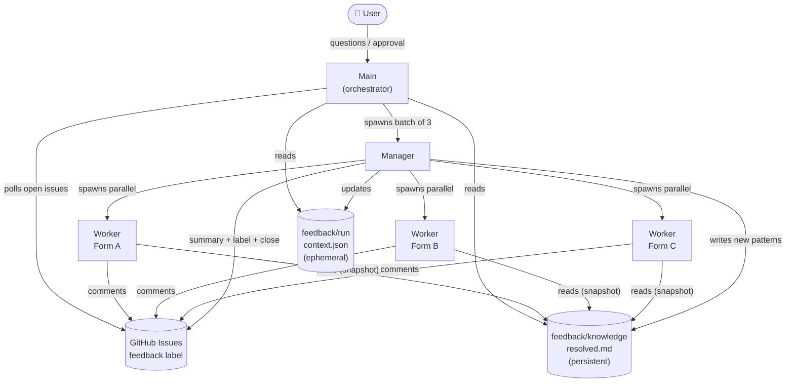

# Plan: AI-driven feedback resolution pipeline (`/feedback` skill)

## Context

QA feedback on converted AEM forms arrives as **GitHub issues**. Rather than fixing forms one by one manually, we want an agent pipeline that polls for open feedback issues, processes them in batches, and posts progress back to each issue.

Architecture: **Main** (orchestrator / user-facing) → **Manager** (batch coordinator) → **Workers** (one per form, parallel). Two persistent stores:
- **`resolved.md`** — growing log of feedback patterns + how they were resolved; Workers consult it before diagnosing so known fixes are applied instantly
- **`context.json`** — ephemeral per-run state: which forms are in progress, done, or blocked

AEM runs at `localhost:4502` — the developer runs `/feedback` locally when AEM is up. Everything else (GitHub issue queue, knowledge sync, status updates) is fully automated.

---

## GitHub issue format

QA submits feedback using the structured issue template (`.github/ISSUE_TEMPLATE/feedback.yml`):

```
**Form:** AAMQ_019
**Feedback:**
- Page 2: Formular Adressat shows wrong options (should have 4, only shows 2)
- Page 3: Missing required marker on Unterschrift field
```

Label lifecycle:
- `feedback` — set by QA when creating the issue; marks it as ready to process
- `claude-in-progress` — set by Main when picked up; acts as a distributed lock
- `claude-done` — set by Manager when all items fixed; **issue stays open** pending PR review; auto-closes when the fix PR is merged
- `claude-blocked` — set by Manager when items remain unfixed; issue stays open for manual intervention

---

## Architecture overview



## Data flow

```mermaid
sequenceDiagram
    participant U as User
    participant GH as GitHub Issues
    participant Main
    participant Mgr as Manager
    participant Wkr as Worker (per form)
    participant R as resolved.md
    participant C as context.json

    U->>Main: /feedback
    Main->>R: read known resolutions
    Main->>C: read context.json

    loop while open feedback issues exist
        Main->>GH: gh issue list --label feedback (open, not in-progress)
        Main->>GH: label batch of 3 claude-in-progress
        Main->>GH: re-read each issue — drop any already claimed
        Main->>Mgr: spawn Managers for confirmed batch

        Mgr->>R: read known resolutions
        Mgr->>C: context_update.py → status=in_progress
        Mgr->>Wkr: spawn parallel (1 form each)

        Wkr->>Wkr: blueprint:start_conversion + get_aem (baseline)

        loop for each feedback item
            Wkr->>R: feedback_match.py → lookup known fix
            Wkr->>Wkr: blueprint:search_references (if no match)
            Wkr->>Wkr: blueprint:edit_aem_content_xml (fix)
            Wkr->>Wkr: blueprint:validate + build + upload_to_aem
            Wkr->>Wkr: blueprint:fetch_aem_form_html (verify)
            Wkr->>GH: gh issue comment → progress update
        end

        Wkr-->>Mgr: { fixed[], unfixed[], new_patterns[] }

        Mgr->>Mgr: sanity check — all input items in fixed[]∪unfixed[]
        Mgr->>R: append new_patterns[] (sequential)
        Mgr->>C: context_update.py → status=done/blocked
        Mgr->>Mgr: git checkout -b fix/<form>-N && git push
        Mgr->>GH: gh pr create (Closes #N)
        Mgr->>GH: comment PR link + claude-done (issue stays open)
        Mgr-->>Main: batch report
    end

    Main-->>U: final summary
```



---

## Agent roles

### Main
- Entry point: runs a loop until no open `feedback` issues remain
- Reads `feedback/knowledge/resolved.md` + `feedback/run/context.json` once at start
- **Does NOT read `engine-bugs.md`** — that is conversion-only knowledge
- Each iteration: `gh issue list --label feedback --state open` (excluding `claude-in-progress`, `claude-done`) → pick next batch of up to 3
- Verifies `forms/issued/<form>_merged.zip` exists for each issue — skips and comments on the issue if the ZIP is missing
- Labels the batch `claude-in-progress`
- **Re-reads each issue** to confirm it now has `claude-in-progress` and not already had it before this agent applied it — drops any issue already claimed by another concurrent agent
- Spawns **3 Managers in parallel** (one per form in confirmed batch); waits for all to complete
- After batch: checks for remaining open issues; repeats or exits
- Collects all results; presents final summary to user

### Manager (3 in parallel per batch)
- Spawned by Main; receives one form (issue number + feedback items)
- Reads `feedback/knowledge/resolved.md` and `feedback/run/context.json`
- Spawns **~3 Workers in parallel** if the form has many independent feedback items; otherwise one
- Collects all Worker results; **sanity-checks that every input feedback item appears in either `fixed[]` or `unfixed[]`**
- Sequentially appends `new_patterns[]` to `resolved.md` — Manager is the only writer (no concurrent write conflicts)
- Marks form done/blocked: `context_update.py --set <form>.status=done|blocked`
- If all items fixed:
  1. Create branch `fix/<form>-<issue-number>`, commit fixed ZIP (`forms/issued/<form>_merged.zip`), push
  2. `gh pr create` — title "Fix: `<form>`", body includes `Closes #<issue-number>` + fix summary
  3. Post comment on issue with PR link; label `claude-done` — **leave issue open** (auto-closes when PR is merged)
- If items remain unfixed: label `claude-blocked`, leave open, route unfixed items to Main
- Returns result to Main

### Worker (one per form, up to ~3 per Manager)
- Spawned by Manager; receives: form code + issue number + feedback items
- `blueprint:start_conversion` — load form from `forms/issued/<form>_merged.zip` into MCP session
- `blueprint:get_aem` — baseline AEM tree for analysis
- For each feedback item:
  1. `feedback_match.py --query "<item>"` → apply known fix if high-confidence match
  2. Otherwise: `blueprint:search_references` / `blueprint:grep_references` → look for matching pattern in known-good reference forms
  3. Otherwise: diagnose from AEM tree, devise fix
  4. `blueprint:edit_aem_content_xml` — targeted XML fix (versioned; no unzip/rezip)
  5. `blueprint:validate_aem_package` → `blueprint:build_aem_package` → `blueprint:upload_to_aem`
  6. `blueprint:fetch_aem_form_html` — verify form renders correctly post-upload
  7. `gh issue comment <number> --body "Fixed: ..."` per resolved item
- `blueprint:write_package path=forms/issued/<form>_merged.zip` — export updated ZIP (Manager will commit this on the fix branch)
- Writes result to `feedback/output/<form>_report.md` (own file — no conflicts)
- Returns `{ fixed[], unfixed[], new_patterns[] }` to Manager

---

## Conflict resolution — no concurrent writes

Workers never write to shared files. All writes to `resolved.md` and `context.json` go through the Manager, which processes Worker results sequentially after all Workers in its batch complete. Each Worker writes only to its own `feedback/output/<form>_report.md`.

GitHub issue labels are used as a best-effort distributed lock, with a re-check step to handle the race window:

1. Main labels the batch `claude-in-progress`
2. Main immediately re-reads each issue — if the label was already present before this agent applied it, another concurrent agent claimed it first; drop it from the batch
3. Only confirmed issues (where this agent was the one that added the label) are passed to Managers

This shrinks the race window to near-zero. In the unlikely event two agents label the same issue simultaneously, the re-check catches it and one agent simply skips that issue on this iteration — it will not be picked up again since it is already `claude-in-progress`.

---

## File structure

```
.github/
  ISSUE_TEMPLATE/
    feedback.yml               ← structured issue template (Form + Feedback fields)

forms/
  issued/
    <form>_merged.zip          ← input ZIPs (Git LFS); committed by developer after conversion
                                  Fixed ZIPs land back here when their fix branch is merged

feedback/
  knowledge/
    resolved.md                ← PERSISTENT: feedback → resolution log
                                  Written only by Manager; read by all

  run/
    context.json               ← EPHEMERAL per run: form status, errors, fixes

  output/
    <form>_report.md           ← per-form fix report (one per Worker)

.claude/references/
  engine-bugs.md               ← existing, conversion-only, unchanged
```

GitHub issues are the input source — there is no `feedback/input/` directory.

**`resolved.md` entry format:**
```markdown
## FEEDBACK-001 — <short title>
**Feedback pattern:** "..." (what the feedback typically says)
**Root cause:** ...
**Fix applied:** ...
**First seen:** <form>
**Seen again:** <forms>
```

---

## New files to create

1. `.github/ISSUE_TEMPLATE/feedback.yml` — structured issue template
2. `feedback/knowledge/resolved.md` — empty template (ready to grow)
3. `feedback/run/context.json` — empty template
4. `.claude/skills/feedback-worker.md` — Worker skill (one per form)
5. `.claude/skills/feedback-manager.md` — Manager skill (coordinates workers per batch)
6. `.claude/skills/feedback.md` — Main skill (`/feedback` command, entry point)

**Main skill steps (`feedback.md`):**
1. Read `feedback/knowledge/resolved.md` + `feedback/run/context.json`
2. Loop:
   a. `gh issue list --label feedback --state open` (exclude `claude-in-progress`, `claude-done`) → take next batch of up to 3
   b. If empty → exit loop
   c. Verify `forms/issued/<form>_merged.zip` exists for each issue — skip and comment if missing
   d. Label batch `claude-in-progress`
   e. Re-read each issue: if it already had `claude-in-progress` before this agent applied it, drop it (claimed by another concurrent agent)
   f. Spawn Managers in parallel for confirmed batch; wait for all to complete
3. Present final summary to user

**Worker skill steps (`feedback-worker.md`):**
1. `blueprint:start_conversion path=forms/issued/<form>_merged.zip` — load session
2. `blueprint:get_aem` — baseline AEM tree for analysis
3. For each feedback item:
   a. `feedback_match.py --query "<item>" --top 3` — check `resolved.md` for known resolution
   b. Otherwise: `blueprint:search_references` / `blueprint:grep_references` — scan reference forms for matching pattern
   c. Otherwise: diagnose from AEM tree, devise fix
   d. `blueprint:edit_aem_content_xml` — apply targeted XML fix (versioned, no unzip/rezip)
   e. `blueprint:validate_aem_package` + `blueprint:build_aem_package` + `blueprint:upload_to_aem`
   f. `blueprint:fetch_aem_form_html` — verify renders correctly; mark fixed or unfixed
   g. `gh issue comment <number> --body "Fixed: ..."` per resolved item
4. `blueprint:write_package path=forms/issued/<form>_merged.zip` — export updated ZIP (Manager commits this on the fix branch)
5. Write `feedback/output/<form>_report.md`
6. Return `{ fixed[], unfixed[], new_patterns[] }` to Manager

**Manager skill steps (`feedback-manager.md`):**
1. Spawn Workers in parallel (one per form in batch)
2. Collect results; sanity-check all input items appear in `fixed[] ∪ unfixed[]`
3. Append `new_patterns[]` to `resolved.md` (sequential — Manager is sole writer)
4. Create branch `fix/<form>-<issue-number>`, commit fixed ZIP, push
5. `gh pr create` with `Closes #<issue-number>` in body
6. Post comment on issue with PR link; label `claude-done` — leave open until PR merges
7. OR label `claude-blocked` if items remain unfixed

---

## New scripts

Two scripts to give agents reliable, reusable primitives for things the MCP does not cover:

### `feedback_match.py`

Given a feedback text string, fuzzy-searches `feedback/knowledge/resolved.md` and returns the top N matching entries ranked by relevance. Workers call this before diagnosing a feedback item — if a match is found with high confidence, they apply the known fix directly without re-solving.

```
python3 .claude/scripts/feedback_match.py \
  --query "Formular Adressat shows wrong options" \
  --resolved feedback/knowledge/resolved.md \
  --top 3
```

Output: ranked list of FEEDBACK-XXX entries with match score.

### `context_update.py`

Atomic read-modify-write on `feedback/run/context.json`. Accepts structured `--set` args so agents never manually edit JSON. Prevents partial writes if a worker crashes mid-update.

```
python3 .claude/scripts/context_update.py \
  --file feedback/run/context.json \
  --set AAFB_019.status=done \
  --set AAFB_019.fixes_applied="maxOccur corrected"
```

All AEM interaction (XML editing, package building, upload, verification) is handled by the `blueprint` MCP server — no additional scripts needed for those operations.

---

## Tooling summary

### `blueprint` MCP server (Workers)

| MCP tool | Purpose |
|----------|---------|
| `start_conversion` | Load form ZIP into session |
| `get_aem` | Structured AEM tree — baseline + analysis |
| `edit_aem_content_xml` | Targeted XML fix, versioned (replaces unzip/rezip) |
| `validate_aem_package` | Validate FileVault structure pre/post fix |
| `build_aem_package` | Rebuild ZIP after edits |
| `upload_to_aem` | Install to AEM |
| `fetch_aem_form_html` | Visual verify form renders post-upload |
| `write_package` | Export updated ZIP back to `forms/` |
| `search_references` | Semantic search of known-good reference forms |
| `grep_references` | Literal/regex search of reference forms |

### Scripts (no MCP equivalent)

| Script | Used by | Purpose |
|--------|---------|---------|
| `feedback_match.py` | Worker | Match feedback text → known resolution in `resolved.md` |
| `context_update.py` | Manager | Atomic read-modify-write on `context.json` |
| `gh` CLI | Main + Worker + Manager | Read issues, post comments, set labels, close issues |

`engine-bugs.md` is **not** used in this pipeline — it belongs to the conversion flow only.

---

## Implementation order

Build bottom-up — each layer depends on the one below it.

1. **GitHub issue template** — `.github/ISSUE_TEMPLATE/feedback.yml`; lets QA submit structured feedback immediately
2. **File templates** — `feedback/knowledge/resolved.md` + `feedback/run/context.json`
3. **Scripts** (only 2 needed — MCP covers the rest):
   a. Write `feedback_match.py` (needs `resolved.md` format from step 2)
   b. Write `context_update.py` (needs `context.json` format from step 2)
4. **Worker skill** (`feedback-worker.md`) — uses scripts + `blueprint` MCP tools
5. **Manager skill** (`feedback-manager.md`) — coordinates Workers, posts to GitHub issues
6. **Main skill** (`feedback.md`) — polls GitHub issues in a loop; drives Managers
7. **End-to-end test** on 1 real issue → then scale to 3 × 3

---

## Appendix — Scaling to multiple developers

The pipeline is designed to scale to a whole team with no coordination overhead. Three things make this work:

**1. Everything in the repo**
Form ZIPs live in `forms/issued/` tracked via Git LFS (the repo already has LFS enabled). Skills, scripts, and the knowledge base (`resolved.md`) live in `.claude/`. A developer joins the team, runs `git pull`, and has everything — the forms to fix, the tools to fix them with, and all the accumulated knowledge from every previous run. No per-machine setup beyond AEM.

```
forms/issued/*_merged.zip filter=lfs diff=lfs merge=lfs -text   ← add to .gitattributes
```

**2. GitHub issues as the work queue**
Main polls for open `feedback` issues and immediately labels each picked-up issue `claude-in-progress`. A second developer running `/feedback` at the same time sees none of those issues — the label is the lock. No two agents ever work the same form. When done, Manager labels the issue `claude-done` and closes it, or `claude-blocked` and leaves it open. The issue is the full audit trail: feedback in, fix comments during processing, final status on close.

**3. Knowledge grows with every run**
After processing a batch, Manager commits and pushes `resolved.md`:
```bash
git add feedback/knowledge/resolved.md && git commit -m "feedback: add N resolved patterns" && git push
```
Every subsequent `/feedback` run by anyone, on any machine, starts with the latest patterns. The more forms are processed, the fewer items require fresh diagnosis.
