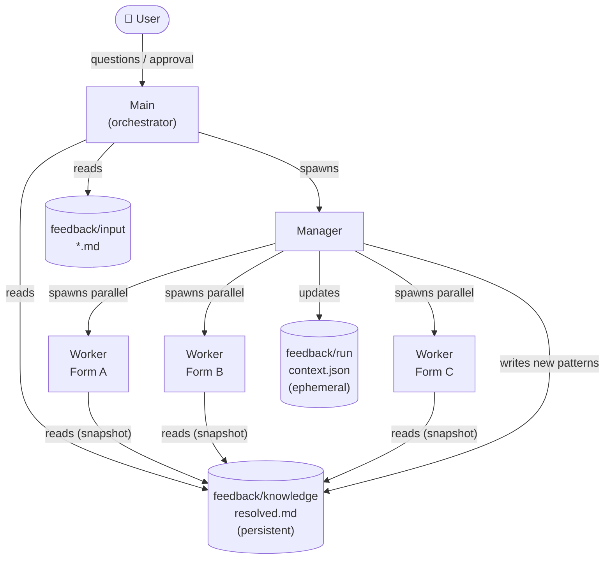
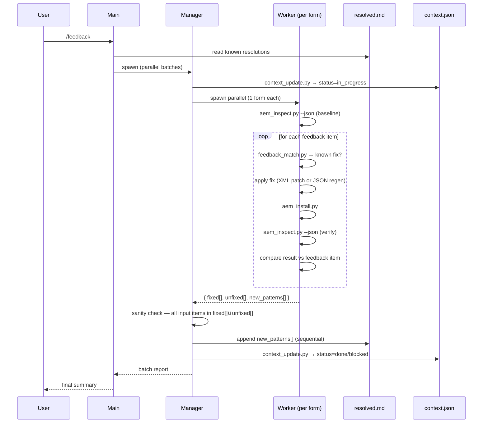

# Plan: AI-driven feedback resolution pipeline (`/feedback` skill)

## Context

Converted AEM forms are receiving QA feedback. Rather than fixing forms one by one manually, we want an agent pipeline that reads all pending feedback, recognises known patterns, and fixes each form in parallel — with humans only needed for edge cases.

The diagram shows a 3-tier architecture: **Main** (orchestrator / user-facing) → **Manager** (coordinator, spawns workers) → **Multiple Workers** (one per form, parallel). Two shared knowledge stores bridge them:
- **Feedback known errors** — persistent log of past feedback + how it was resolved. Format: "feedback said X → root cause was Y → fix applied was Z." Grows over time; workers read it before solving to reuse known resolutions.
- **Context** — ephemeral per-run state: which forms are pending/done/blocked, errors found, fixes applied.

---

## Architecture overview



## Data flow



---

## Agent roles

### Main
- Entry point: reads all feedback input files + `feedback/knowledge/resolved.md`
- **Does NOT read `engine-bugs.md`** — that is conversion-only knowledge
- Splits all forms with pending feedback into batches; spawns **~3 Managers in parallel**
- Answers questions from Managers when human context is needed
- Collects all Manager results; presents final summary to user

### Manager (~3 in parallel, each handling a batch of forms)
- Spawned by Main; receives a batch of N forms
- Marks forms in progress: `context_update.py --set <form>.status=in_progress`
- Spawns **~3 Workers in parallel** (one per form in its batch)
- Collects all Worker results; **sanity-checks that every input feedback item appears in either `fixed[]` or `unfixed[]`** — catches Workers that silently dropped an item
- Sequentially appends `new_patterns[]` to `resolved.md` — Manager is the only writer (no concurrent write conflicts)
- Marks forms done/blocked: `context_update.py --set <form>.status=done|blocked`
- Routes `unfixed[]` items back up to Main for escalation

### Worker (one per form, ~3 per Manager → ~9 total in parallel)
- Spawned by Manager; receives: form code + feedback items
- Takes a **baseline snapshot**: `aem_inspect.py --json` before any changes
- For each feedback item:
  1. `feedback_match.py --query "<item>"` → apply known fix if high-confidence match
  2. Otherwise: diagnose from baseline snapshot + ZIP/JSON, devise fix
  3. Apply fix: XML patch cycle or JSON edit + regenerate
  4. `aem_install.py <form>_merged.zip`
  5. `aem_inspect.py --json` → compare result against this feedback item — mark fixed or unfixed
- Writes result to `feedback/output/<form>_report.md` (own file — no conflicts)
- Returns `{ fixed[], unfixed[], new_patterns[] }` to Manager

---

## Conflict resolution — no concurrent writes

Workers never write to shared files. All writes to `resolved.md` and `context.json` go through the Manager, which processes Worker results sequentially after all Workers in its batch complete. Each Worker writes only to its own `feedback/output/<form>_report.md`.

---

## File structure

```
feedback/
  input/
    <form>.md                  ← feedback per form; format TBD, pluggable

  knowledge/
    resolved.md                ← PERSISTENT: feedback → resolution log
                                  Written only by Manager; read by all

  run/
    context.json               ← EPHEMERAL per run: form status, errors, fixes

  output/
    <form>_report.md           ← per-form fix report (one per Worker)

.claude/references/
  engine-bugs.md               ← existing, conversion-only, unchanged
```

**`resolved.md` entry format:**
```markdown
## FEEDBACK-001 — <short title>
**Feedback pattern:** "..." (what the feedback typically says)
**Root cause:** ...
**Fix applied:** ...
**First seen:** <form>
**Seen again:** <forms>
```

---

## New files to create

1. `feedback/knowledge/resolved.md` — empty template (ready to grow)
2. `feedback/run/context.json` — empty template
3. `.claude/skills/feedback.md` — Main skill (`/feedback` command)
4. `.claude/skills/feedback-worker.md` — Worker skill (one per form)

**Main skill steps (`feedback.md`):**
1. Read all `feedback/input/*.md` files → group by form code
2. Read `feedback/knowledge/resolved.md`
3. Split forms into batches of ~3; spawn Managers in parallel
4. Collect results; write final summary to user

**Worker skill steps (`feedback-worker.md`):**
1. `curl ... | aem_inspect.py --json` — baseline snapshot before any changes
2. For each feedback item:
   a. `feedback_match.py --query "<item>" --top 3` — check for known resolution
   b. Apply fix (known or freshly diagnosed): XML patch cycle or JSON + regenerate
   c. `aem_install.py <form>_merged.zip`
   d. `curl ... | aem_inspect.py --json` — verify this item is resolved; mark fixed or unfixed
3. Write `feedback/output/<form>_report.md`
4. Return `{ fixed[], unfixed[], new_patterns[] }` to Manager

---

## New scripts

Four scripts to give agents reliable, reusable primitives instead of ad-hoc bash:

### `feedback_match.py`

Given a feedback text string, fuzzy-searches `feedback/knowledge/resolved.md` and returns the top N matching entries ranked by relevance. Workers call this before diagnosing a feedback item — if a match is found with high confidence, they apply the known fix directly without re-solving.

```
python3 .claude/scripts/feedback_match.py \
  --query "Formular Adressat shows wrong options" \
  --resolved feedback/knowledge/resolved.md \
  --top 3
```

Output: ranked list of FEEDBACK-XXX entries with match score.

### `context_update.py`

Atomic read-modify-write on `feedback/run/context.json`. Accepts structured `--set` args so agents never manually edit JSON. Prevents partial writes if a worker crashes mid-update.

```
python3 .claude/scripts/context_update.py \
  --file feedback/run/context.json \
  --set AAFB_019.status=done \
  --set AAFB_019.fixes_applied="maxOccur corrected"
```

### `aem_inspect.py --json`

Extend the existing `aem_inspect.py` with a `--json` flag that outputs a machine-readable JSON object instead of the current human-readable text. Workers can pipe the output to `jq` or parse it directly for automated decision-making.

```bash
curl -s ... | python3 .claude/scripts/aem_inspect.py --json
# → { "panels": [...], "issues": [...] }
```

The default text output is unchanged — `--json` is additive.

### `aem_install.py`

Wraps the AEM package install curl call + XML response parsing into a single script that exits `0` on success and `1` on failure, printing a clean one-line result. Removes the need for every agent to re-implement XML grep on the curl response.

```bash
python3 .claude/scripts/aem_install.py AAFB_019_merged.zip
# → Installed: AAFB (200 OK)
# or: Error: package upload failed — <reason>
```

---

## Tooling summary

| Script | Used by | Purpose |
|--------|---------|---------|
| `feedback_match.py` | Worker | Match feedback text → known resolution in `resolved.md` |
| `context_update.py` | Manager | Atomic read-modify-write on `context.json` |
| `aem_inspect.py --json` | Worker | Structured form state from AEM (diagnose + verify) |
| `aem_install.py` | Worker | Install ZIP, clean exit code, no XML parsing |
| XML patch cycle (bash) | Worker | unzip → edit → rezip for XML-only fixes |
| `fragment_coverage.json` | Worker | ENGINE DUPLICATE detection during diagnosis |

`engine-bugs.md` is **not** used in this pipeline — it belongs to the conversion flow only.

---

## Implementation order

1. Create `feedback/knowledge/resolved.md` + `feedback/run/context.json` templates
2. Write `feedback-worker.md` skill
3. Write `feedback.md` main skill
4. Define `feedback/input/` format (when concrete feedback arrives)
5. Test on 1 form → then scale to 3 × 3
