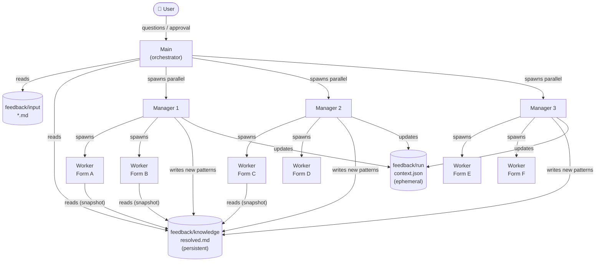
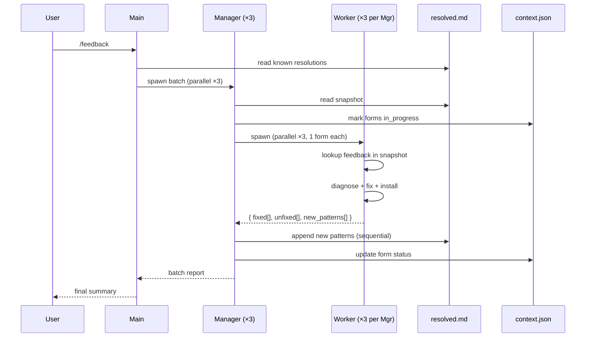

# Plan: AI-driven feedback resolution pipeline (`/feedback` skill)

## Context

Converted AEM forms are receiving QA feedback. Rather than fixing forms one by one manually, we want an agent pipeline that reads all pending feedback, recognises known patterns, and fixes each form in parallel — with humans only needed for edge cases.

The diagram shows a 3-tier architecture: **Main** (orchestrator / user-facing) → **Manager** (coordinator, spawns workers) → **Multiple Workers** (one per form, parallel). Two shared knowledge stores bridge them:
- **Feedback known errors** — persistent log of past feedback + how it was resolved. Format: "feedback said X → root cause was Y → fix applied was Z." Grows over time; workers read it before solving to reuse known resolutions.
- **Context** — ephemeral per-run state: which forms are pending/done/blocked, errors found, fixes applied.

---

## Architecture overview



## Data flow



---

## Agent roles

### Main
- Entry point: reads all feedback input files + `feedback/knowledge/resolved.md`
- **Does NOT read `engine-bugs.md`** — that is conversion-only knowledge
- Splits all forms with pending feedback into batches; spawns **~3 Managers in parallel**
- Answers questions from Managers when human context is needed
- Collects all Manager results; presents final summary to user

### Manager (~3 in parallel, each handling a batch of forms)
- Spawned by Main; receives a batch of N forms
- Reads `feedback/knowledge/resolved.md` and `feedback/run/context.json`
- Spawns **~3 Workers in parallel** (one per form in its batch)
- Collects all Worker results; **sequentially appends new patterns to `resolved.md`** — Manager is the only writer, Workers never write directly (no concurrent file conflicts)
- Updates `context.json` with per-form status
- Routes blocked questions back up to Main

### Worker (one per form, ~3 per Manager → ~9 total in parallel)
- Spawned by Manager; receives: form code + feedback items + read-only snapshot of `resolved.md`
- Reads `<form>_merged.zip` + `<form>_merged.json`
- Looks up each feedback item in `resolved.md` snapshot → apply known fix if found
- For unknown feedback: diagnose (inspect AEM, check XML/JSON), devise fix, apply
- Install + re-inspect via `aem_inspect.py`
- Writes result to `feedback/output/<form>_report.md` (own file — no conflicts)
- Returns structured result to Manager: `{ fixed[], unfixed[], new_patterns[] }`

---

## Conflict resolution — no concurrent writes

Workers never write to shared files. All writes to `resolved.md` and `context.json` go through the Manager, which processes Worker results sequentially after all Workers in its batch complete. Each Worker writes only to its own `feedback/output/<form>_report.md`.

---

## File structure

```
feedback/
  input/
    <form>.md                  ← feedback per form; format TBD, pluggable

  knowledge/
    resolved.md                ← PERSISTENT: feedback → resolution log
                                  Written only by Manager; read by all

  run/
    context.json               ← EPHEMERAL per run: form status, errors, fixes

  output/
    <form>_report.md           ← per-form fix report (one per Worker)

.claude/references/
  engine-bugs.md               ← existing, conversion-only, unchanged
```

**`resolved.md` entry format:**
```markdown
## FEEDBACK-001 — <short title>
**Feedback pattern:** "..." (what the feedback typically says)
**Root cause:** ...
**Fix applied:** ...
**First seen:** <form>
**Seen again:** <forms>
```

---

## New files to create

1. `feedback/knowledge/resolved.md` — empty template (ready to grow)
2. `feedback/run/context.json` — empty template
3. `.claude/skills/feedback.md` — Main skill (`/feedback` command)
4. `.claude/skills/feedback-worker.md` — Worker skill (one per form)

**Main skill steps (`feedback.md`):**
1. Read all `feedback/input/*.md` files → group by form code
2. Read `feedback/knowledge/resolved.md`
3. Split forms into batches of ~3; spawn Managers in parallel
4. Collect results; write final summary to user

**Worker skill steps (`feedback-worker.md`):**
1. Read form feedback items + `resolved.md` snapshot
2. For each feedback item: look up in `resolved.md` → apply known fix, or diagnose fresh
3. Fetch AEM form state via JCR API (same as `/install`)
4. Apply fixes (XML patch cycle or JSON + regenerate)
5. Install + run `aem_inspect.py`
6. Write `feedback/output/<form>_report.md`
7. Return `{ fixed[], unfixed[], new_patterns[] }` to Manager

---

## Reuse from existing tooling

| Existing | Reused by |
|----------|-----------|
| `.claude/scripts/aem_inspect.py` | Worker — post-fix verification |
| `/install` XML patch cycle | Worker — fix application |
| `feedback/knowledge/resolved.md` | Worker (read) + Manager (write) |
| `.claude/settings.json` permissions | All agents |

`engine-bugs.md` is **not** used in this pipeline — it belongs to the conversion flow only.

---

## Implementation order

1. Create `feedback/knowledge/resolved.md` + `feedback/run/context.json` templates
2. Write `feedback-worker.md` skill
3. Write `feedback.md` main skill
4. Define `feedback/input/` format (when concrete feedback arrives)
5. Test on 1 form → then scale to 3 × 3
