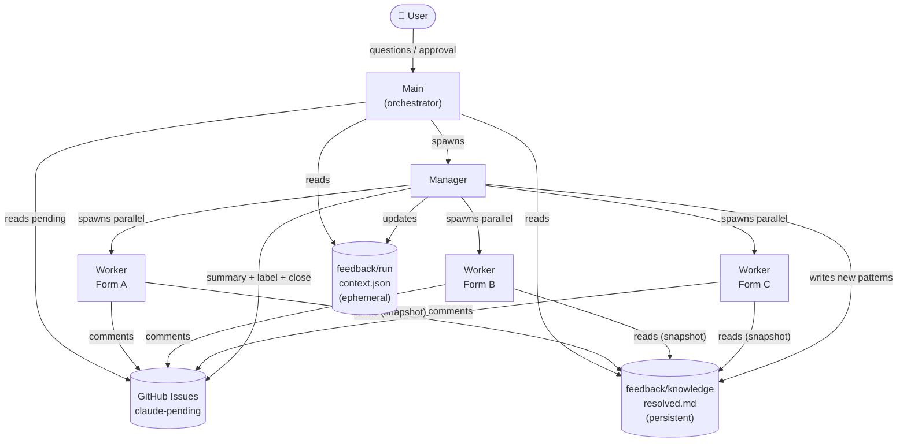
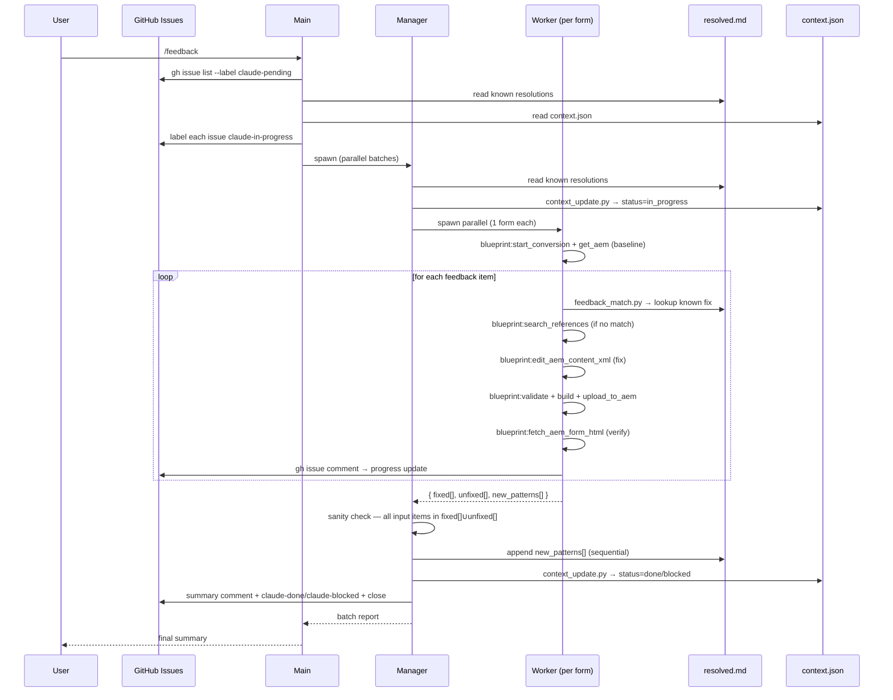

# Plan: AI-driven feedback resolution pipeline (`/feedback` skill)

## Context

QA feedback on converted AEM forms arrives as **GitHub issues**. Rather than fixing forms one by one manually, we want an agent pipeline that reads all `claude-pending` issues, recognises known patterns, and fixes each form in parallel — posting progress back to the issue as it goes.

Architecture: **Main** (orchestrator / user-facing) → **Manager** (batch coordinator) → **Workers** (one per form, parallel). Two persistent stores:
- **`resolved.md`** — growing log of feedback patterns + how they were resolved; Workers consult it before diagnosing so known fixes are applied instantly
- **`context.json`** — ephemeral per-run state: which forms are in progress, done, or blocked

AEM runs at `localhost:4502` — the developer runs `/feedback` locally when AEM is up. Everything else (GitHub issue queue, knowledge sync, status updates) is fully automated.

---

## GitHub issue format

QA submits feedback using the structured issue template (`.github/ISSUE_TEMPLATE/feedback.yml`):

```
**Form:** AAMQ_019
**Feedback:**
- Page 2: Formular Adressat shows wrong options (should have 4, only shows 2)
- Page 3: Missing required marker on Unterschrift field
```

Label lifecycle:
- `feedback` — set by QA when creating the issue; triggers the GitHub Action
- `claude-pending` — added by GitHub Action after validation; means ready to process
- `claude-in-progress` — set by Main when picked up; acts as a distributed lock
- `claude-done` — set by Manager when all items fixed; issue is closed
- `claude-blocked` — set by Manager when items remain unfixed; issue stays open

---

## GitHub Action (`.github/workflows/feedback-label.yml`)

Triggers on `issues.opened` where label `feedback` is present:
1. Validates issue body has a `**Form:**` line + at least one `**Feedback:**` item — comments with an error and stops if malformed
2. Adds label `claude-pending`
3. Posts comment: "Feedback logged — run `/feedback` locally to process (AEM must be running)"

This is the only cloud-side step. Everything from here runs locally.

---

## Architecture overview



## Data flow



---

## Agent roles

### Main
- Entry point: `gh issue list --label claude-pending --json number,title,body` — reads all pending issues
- Reads `feedback/knowledge/resolved.md` + `feedback/run/context.json`
- **Does NOT read `engine-bugs.md`** — that is conversion-only knowledge
- Labels each issue `claude-in-progress`, removes `claude-pending` — acts as a distributed lock
- Splits forms into batches; spawns **~3 Managers in parallel**
- Answers questions from Managers when human context is needed
- Collects all Manager results; presents final summary to user

### Manager (~3 in parallel, each handling a batch of forms)
- Spawned by Main; receives a batch of N forms (each with issue number + feedback items)
- Reads `feedback/knowledge/resolved.md` and `feedback/run/context.json`
- Spawns **~3 Workers in parallel** (one per form in its batch)
- Collects all Worker results; **sanity-checks that every input feedback item appears in either `fixed[]` or `unfixed[]`**
- Sequentially appends `new_patterns[]` to `resolved.md` — Manager is the only writer (no concurrent write conflicts)
- Marks forms done/blocked: `context_update.py --set <form>.status=done|blocked`
- Posts summary comment on each issue; labels `claude-done` + closes, or labels `claude-blocked` + leaves open
- Routes `unfixed[]` items back up to Main for escalation

### Worker (one per form, ~3 per Manager → ~9 total in parallel)
- Spawned by Manager; receives: form code + issue number + feedback items
- `blueprint:start_conversion` — load form from `forms/<form>_merged.zip` into MCP session
- `blueprint:get_aem` — baseline AEM tree for analysis
- For each feedback item:
  1. `feedback_match.py --query "<item>"` → apply known fix if high-confidence match
  2. Otherwise: `blueprint:search_references` / `blueprint:grep_references` → look for matching pattern in known-good reference forms
  3. Otherwise: diagnose from AEM tree, devise fix
  4. `blueprint:edit_aem_content_xml` — targeted XML fix (versioned; no unzip/rezip)
  5. `blueprint:validate_aem_package` → `blueprint:build_aem_package` → `blueprint:upload_to_aem`
  6. `blueprint:fetch_aem_form_html` — verify form renders correctly post-upload
  7. `gh issue comment <number> --body "Fixed: ..."` per resolved item
- `blueprint:write_package path=forms/<form>_merged.zip` — export updated ZIP
- Writes result to `feedback/output/<form>_report.md` (own file — no conflicts)
- Returns `{ fixed[], unfixed[], new_patterns[] }` to Manager

---

## Conflict resolution — no concurrent writes

Workers never write to shared files. All writes to `resolved.md` and `context.json` go through the Manager, which processes Worker results sequentially after all Workers in its batch complete. Each Worker writes only to its own `feedback/output/<form>_report.md`.

GitHub issue labels prevent concurrent work on the same form: Main labels each issue `claude-in-progress` before spawning Managers, so a second developer running `/feedback` at the same time will not pick up the same issues.

---

## File structure

```
.github/
  ISSUE_TEMPLATE/
    feedback.yml               ← structured issue template (Form + Feedback fields)
  workflows/
    feedback-label.yml         ← validates issue + adds claude-pending label

forms/
  <form>_merged.zip            ← form packages (Git LFS); Workers read and write back here

feedback/
  knowledge/
    resolved.md                ← PERSISTENT: feedback → resolution log
                                  Written only by Manager; read by all

  run/
    context.json               ← EPHEMERAL per run: form status, errors, fixes

  output/
    <form>_report.md           ← per-form fix report (one per Worker)

.claude/references/
  engine-bugs.md               ← existing, conversion-only, unchanged
```

GitHub issues are the input source — there is no `feedback/input/` directory.

**`resolved.md` entry format:**
```markdown
## FEEDBACK-001 — <short title>
**Feedback pattern:** "..." (what the feedback typically says)
**Root cause:** ...
**Fix applied:** ...
**First seen:** <form>
**Seen again:** <forms>
```

---

## New files to create

1. `.github/ISSUE_TEMPLATE/feedback.yml` — structured issue template
2. `.github/workflows/feedback-label.yml` — validates + labels new `feedback` issues
3. `feedback/knowledge/resolved.md` — empty template (ready to grow)
4. `feedback/run/context.json` — empty template
5. `.claude/skills/feedback-worker.md` — Worker skill (one per form)
6. `.claude/skills/feedback-manager.md` — Manager skill (coordinates workers per batch)
7. `.claude/skills/feedback.md` — Main skill (`/feedback` command, entry point)

**Main skill steps (`feedback.md`):**
1. `gh issue list --label claude-pending --json number,title,body` → parse into form batches
2. Read `feedback/knowledge/resolved.md` + `feedback/run/context.json`
3. Label all fetched issues `claude-in-progress`, remove `claude-pending`
4. Split forms into batches of ~3; spawn Managers in parallel
5. Collect results; write final summary to user

**Worker skill steps (`feedback-worker.md`):**
1. `blueprint:start_conversion path=forms/<form>_merged.zip` — load session
2. `blueprint:get_aem` — baseline AEM tree for analysis
3. For each feedback item:
   a. `feedback_match.py --query "<item>" --top 3` — check `resolved.md` for known resolution
   b. Otherwise: `blueprint:search_references` / `blueprint:grep_references` — scan reference forms for matching pattern
   c. Otherwise: diagnose from AEM tree, devise fix
   d. `blueprint:edit_aem_content_xml` — apply targeted XML fix (versioned, no unzip/rezip)
   e. `blueprint:validate_aem_package` + `blueprint:build_aem_package` + `blueprint:upload_to_aem`
   f. `blueprint:fetch_aem_form_html` — verify renders correctly; mark fixed or unfixed
   g. `gh issue comment <number> --body "Fixed: ..."` per resolved item
4. `blueprint:write_package path=forms/<form>_merged.zip` — export updated ZIP back to repo
5. Write `feedback/output/<form>_report.md`
6. Return `{ fixed[], unfixed[], new_patterns[] }` to Manager

**Manager skill steps (`feedback-manager.md`):**
1. Spawn Workers in parallel (one per form in batch)
2. Collect results; sanity-check all input items appear in `fixed[] ∪ unfixed[]`
3. Append `new_patterns[]` to `resolved.md` (sequential — Manager is sole writer)
4. Post final summary comment on each issue via `gh issue comment`
5. Label issue `claude-done` + close, OR label `claude-blocked` and leave open

---

## New scripts

Two scripts to give agents reliable, reusable primitives for things the MCP does not cover:

### `feedback_match.py`

Given a feedback text string, fuzzy-searches `feedback/knowledge/resolved.md` and returns the top N matching entries ranked by relevance. Workers call this before diagnosing a feedback item — if a match is found with high confidence, they apply the known fix directly without re-solving.

```
python3 .claude/scripts/feedback_match.py \
  --query "Formular Adressat shows wrong options" \
  --resolved feedback/knowledge/resolved.md \
  --top 3
```

Output: ranked list of FEEDBACK-XXX entries with match score.

### `context_update.py`

Atomic read-modify-write on `feedback/run/context.json`. Accepts structured `--set` args so agents never manually edit JSON. Prevents partial writes if a worker crashes mid-update.

```
python3 .claude/scripts/context_update.py \
  --file feedback/run/context.json \
  --set AAFB_019.status=done \
  --set AAFB_019.fixes_applied="maxOccur corrected"
```

All AEM interaction (XML editing, package building, upload, verification) is handled by the `blueprint` MCP server — no additional scripts needed for those operations.

---

## Tooling summary

### `blueprint` MCP server (Workers)

| MCP tool | Purpose |
|----------|---------|
| `start_conversion` | Load form ZIP into session |
| `get_aem` | Structured AEM tree — baseline + analysis |
| `edit_aem_content_xml` | Targeted XML fix, versioned (replaces unzip/rezip) |
| `validate_aem_package` | Validate FileVault structure pre/post fix |
| `build_aem_package` | Rebuild ZIP after edits |
| `upload_to_aem` | Install to AEM |
| `fetch_aem_form_html` | Visual verify form renders post-upload |
| `write_package` | Export updated ZIP back to `forms/` |
| `search_references` | Semantic search of known-good reference forms |
| `grep_references` | Literal/regex search of reference forms |

### Scripts (no MCP equivalent)

| Script | Used by | Purpose |
|--------|---------|---------|
| `feedback_match.py` | Worker | Match feedback text → known resolution in `resolved.md` |
| `context_update.py` | Manager | Atomic read-modify-write on `context.json` |
| `gh` CLI | Main + Worker + Manager | Read issues, post comments, set labels, close issues |

`engine-bugs.md` is **not** used in this pipeline — it belongs to the conversion flow only.

---

## Implementation order

Build bottom-up — each layer depends on the one below it.

1. **GitHub issue template + Action** — `.github/ISSUE_TEMPLATE/feedback.yml` + `feedback-label.yml`; lets QA submit real feedback immediately
2. **File templates** — `feedback/knowledge/resolved.md` + `feedback/run/context.json`
3. **Scripts** (only 2 needed — MCP covers the rest):
   a. Write `feedback_match.py` (needs `resolved.md` format from step 2)
   b. Write `context_update.py` (needs `context.json` format from step 2)
4. **Worker skill** (`feedback-worker.md`) — uses scripts + `blueprint` MCP tools
5. **Manager skill** (`feedback-manager.md`) — coordinates Workers, posts to GitHub issues
6. **Main skill** (`feedback.md`) — reads GitHub issues; drives Managers
7. **End-to-end test** on 1 real issue → then scale to 3 × 3

---

## Appendix — Scaling to multiple developers

The pipeline is designed to scale to a whole team with no coordination overhead. Three things make this work:

**1. Everything in the repo**
Form ZIPs live in `forms/` tracked via Git LFS (the repo already has LFS enabled). Skills, scripts, and the knowledge base (`resolved.md`) live in `.claude/`. A developer joins the team, runs `git pull`, and has everything — the forms to fix, the tools to fix them with, and all the accumulated knowledge from every previous run. No per-machine setup beyond AEM.

```
forms/*_merged.zip filter=lfs diff=lfs merge=lfs -text   ← add to .gitattributes
```

**2. GitHub issues as the work queue**
QA submits feedback as a GitHub issue. The GitHub Action labels it `claude-pending`. When a developer runs `/feedback`, Main reads all `claude-pending` issues and immediately labels each one `claude-in-progress`. A second developer running `/feedback` at the same time sees none of those issues — the label is the lock. No two agents ever work the same form. When done, Manager labels the issue `claude-done` and closes it, or `claude-blocked` and leaves it open. The issue is the full audit trail: feedback in, fix comments during processing, final status on close.

**3. Knowledge grows with every run**
After processing a batch, Manager commits and pushes `resolved.md`:
```bash
git add feedback/knowledge/resolved.md && git commit -m "feedback: add N resolved patterns" && git push
```
Every subsequent `/feedback` run by anyone, on any machine, starts with the latest patterns. The more forms are processed, the fewer items require fresh diagnosis.
